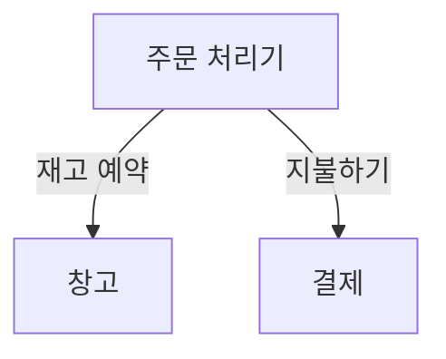

# Chapter 02 마이크로서비스 모델링 방법

> 상대의 논리를 보면 "세상이 무엇이 떠받치고 있을까?"라는 질문에 "거북이가 떠받치고 있지."라고 대답한 이교도가 떠오른다. 그럼 그 거북이를 떠받치는 것은 대체 뭘까? "그건 또 다른 거북이지."
> - 목사 조셉 프레드릭 버그(1854)

- 정보 은닉, 결합, 응집력
- 마이크로서비스 주변의 경계를 그리는 것에 대한 생각이 어떻게 변화되는지 알아본다.
- 또한 사용할 수 있는 다양한 `분해 decomposition` 형태를 살펴보고 이 분야에서 매우 유용한 기술인 도메인 주도 설계도 더 깊이 탐구할 것이다.

 

## 1. 뮤직코프 소개

- 가상 시나리오
- 오프라인 위주 판매 => 레코드판 사업이 바닥 => 이제야말로 온라인 판매에 집중 (이미 웹 사이트를 가지고 있음.)
- 음악용 소프트웨어는 일시적 유행, CD가 집 앞에 도착하길 기다릴 것이라고 판단. (편리함보다는 품질 추구)
- 스트리밍 비즈니스가 모두 곧 붕괴될 것이라고 확신하는 상태
- 세계를 석권할 가장 좋은 기회는 쉽게 변화하는 것이라고 판단 => 바로 마이크로서비스를 통해

 

## 2. 올바른 마이크로서비스 경계를 만드는 것은 무엇인가?

- 한 마이크로서비스를 다른 마이크로서비스와 별개로 변경할 수 있는 능력은 매우 중요하다. 그렇다면 마이크로서비스 주변의 경계를 정하는 방법을 생각할 때 어떤 점을 염두에 둬야 할까?
    - 결국 모듈식 분해의 또 다른 형태일 뿐이다.
    - 이런 사실은 경계를 정의하는 방법을 찾는 데 모듈식 소프트웨어와 구조적 프로그래밍 영역에 존재하는 많은 선행 기술에 의지할 수 있다는 것을 의미한다.

### 2-1. 정보 은닉

- `정보 은닉 information hiding`. 모듈 경계를 정의하는 가장 효과적인 방법을 찾으려고 데이비드 파나스가 만든 개념
- 정보 은닉은 모듈 경계 뒤에 가능한 한 많은 세부 정보를 숨기려는 욕구를 나타낸다.

#### 향상된 개발 시간

- 모듈을 독립적으로 개발함에 따라 더 많은 작업을 병렬로 수행할 수 있고, 프로젝트에 더 많은 개발자를 추가하는 데 따른 영향을 줄일 수 있다.

#### 이해도

- 각 모듈이 따로따로 살펴보고 이해할 수 있다. 이는 시스템 전체가 수행하는 작업을 더 쉽게 이해하도록 해준다.

#### 유연성

- 모듈은 서로 독립적으로 변경 가능하므로 다른 모듈을 변경하지 않고도 시스템 기능을 변경할 수 있다.
- 게다가 모듈을 다양한 방식으로 결합해 새로운 기능을 제공할 수 있다.

 

- 이러한 매력적인 특징은 마이크로서비스 아키텍처를 통해 성취하려는 것을 훌륭하게 완성한다.

> 모듈 간 연결은 모듈이 서로에게 만드는 `가정 assumption`이다.

- 하나의 모듈이 다른 모듈에 대해 만드는 가정의 수를 줄임으로써 모듈 간의 연결에 직접적으로 영향을 미친다.
    - 가정의 수를 작게 유지하면, 다른 모듈에 영향을 미치지 않고 하나의 모듈을 변경하기가 더 쉽다.
    - 모듈을 변경하는 개발자가 다른 사람들이 해당 모듈을 어떻게 사용하는지 명확히 이해하고 있다면, 업스트림 호출자도 변경할 필요가 없는 방식으로 안전하게 변경하도록 만들 가능성이 더 높을 것이다.

### 2-2. 응집력

- `응집력 cohesion`을 나타내는 가장 간결한 정의 중 하나는 '함께 바뀌고 함께 머무는 코드다.'
- 여러 곳에서 행동을 변경해야 한다면 이 변경 사항을 제공하기 위해 많은 다른 서비스를 동시에 릴리스해야 할 것이다.
- 여러 곳에서 변경하는 것은 느리고 한 번에 많은 서비스를 배포하는 것은 위험하므로 두 가지 다 피하고 싶다.
- 따라서 문제 영역 내에서 관련 동작을 한 곳으로 모으며, 다른 경계와 가능한 한 느슨하게 통신할 수 있는 경계를 찾길 원한다.
- 마이크로서비스 아키텍처는 강한 응집력을 목표로 한다.

### 2-3. 결합

- 서비스가 느슨하게 결합됐다면 한 서비스를 변경할 때 다른 서비스를 변경할 필요가 없다.
- 그렇다면 어떤 종류가 강한 결합을 유발할까?
    - 전형적인 실수는 한 서비스를 다른 서비스에 단단히 결합하는 통합 방식을 선택해 서비스 내부가 변경되면 소비자도 변경하도록 요구하는 것이다.
- 느슨하게 결합된 서비스는 함께 협업하는 서비스들에 대해 꼭 필요한 만큼만 알고 있다.

### 2-4. 결합과 응집력의 연관성

- 결합과 응집력은 개념적으로 분명 관련이 있다.
- 논리적으로 연관된 기능이 시스템 전체에 분산돼 있다면, 이 기능에 대한 변경은 이러한 경계를 넘어 전파돼 더 긴밀한 결합을 나타낸다.

> `콘스탄틴의 법칙 Constantine's law`
> - 응집력이 강하고 결합도가 낮으면 구조가 안정된다.

- 여기서 `안정성 stability`의 개념은 중요하다.
    - 팀 간의 조정 작업량을 줄이려면 경계 자체에 어느 정도의 안정성은 필요하다.
    - 마이크로서비스가 제공하는 계약이 하위 호환성을 깨뜨리는 방식으로 계속 변경된다면 상위 소비자도 지속적으로 변경해야 할 것이다.
- 응집력은 경계 내부에 있는 사물 사이의 관계에 적용되는 반면, 결합은 경계 건너에 있는 사물 간의 관계를 설명한다.

 

## 3. 결합 유형

- 앞서 설명한 개요에 따르면 모든 결합이 나쁘다고 생각할 수 있다. 엄밀히 말해 이것은 사실이 아니다.
    - 궁극적으로 시스템에서 일부 결합은 피할 수 없으며, 우리는 결합의 양을 줄이길 원한다.
- 주로 모듈식 소프트웨어를 고려하는 구조적 프로그래밍 맥락에서 다양한 결합 형태를 살펴보고자 많은 연구가 수행돼 왔다.
    - 결합의 중첩 및 충돌을 평가하는 다양한 모델 중 상당수는 서비스 기반 상호작용보다는 코드 수준에서 주로 이야기된다.
    - 마이크로서비스는 모듈식 아키텍처의 한 형태이므로 (분산 시스템의 복잡성이 추가됐지만), 이러한 원시 개념을 많이 사용할 수 있고 마이크로서비스 기반 시스템 관점에도 적용할 수 있다.

### 3-1. 도메인 결합

- `도메인 결합 domain coupling`은 첫 번째 마이크로서비스가 다른 마이크로서비스가 제공하는 기능을 사용해야 하므로 하나의 마이크로서비스가 다른 마이크로서비스와 상호작용해야 하는 상황을 설명한다.
- 아래 예시는 뮤직코프 내부에서 CD 주문이 관리되는 일부 방식을 보여준다.
    - 주문 처리기(Order Processor)는 창고 마이크로서비스를 호출해 재고를 예약하고, 결제 마이크로서비스를 호출해 결제한다.
    - 따라서 주문 처리기는 이 작업을 위해 창고(Warehouse) 및 결제(Payment) 마이크로서비스에 의존하고 결합된다.
    - 하지만 창고 서비스와 결제 서비스 사이에는 상호작용이 없으므로 결합도 없다.

- 이런 유형의 상호작용은 대개 불가피하다.
- 많은 하위 마이크로서비스와 통신해야 하는 마이크로서비스는 너무 많은 로직이 집중되는 상황을 만든다.
    - 도메인 결합은 서비스 간에 더 복잡한 데이터 집합이 전송됨에 따라 문제가 될 수 있다.
    - 정보 은닉의 중요성을 명심하라. 꼭 필요한 것만 공유하고 필요한 최소한의 데이터만 전송해야 한다.

> 시간적 결합에 대한 간략한 정리
> - `시간적 결합 temporal coupling`은 하나의 마이크로서비스가 작업을 완료하기 위해 동시간에 어떤 작업을 수행하는 다른 마이크로서비스가 필요한 상황을 나타낸다.
> - 작업을 완료하려면 두 마이크로서비스가 동시에 작동하고 서로 통신할 수 있어야 한다.
    >   - 어떤 이유로 다른 서비스와 연결할 수 없다면 해당 작업은 실패하게 된다.
>   - 또한 응답을 기다려야 하므로 잠재적으로 리소스 경합과 관련된 문제를 유발할 수 있다.
> - 시간적 결합이 항상 나쁜 것은 아니지만 인지해둘 필요는 있다.
    >   - 마이크로서비스가 늘어나 상호작용이 더 복잡해지면 시간적 결합 문제가 증가하므로 시스템을 확장하고 작동 상태를 유지하기가 더 어려워질 수 있다.
>   - 시간적 결합을 피하는 한 가지 방법은 메시지 브로커와 같은 비동기 통신 형태를 사용하는 것이다.

### 3-2. 통과 결합

- `통과 결합 pass-through coupling`은 데이터가 다른 하위 마이크로서비스에 필요하다는 이유만으로 한 마이크로서비스가 다른 마이크로서비스에 데이터를 전달하는 상황을 말한다.
    - 여러 면에서 이 상황은 결합을 구현하는 데 가장 많은 문제를 유발하는 형태 중 하나다.
    - 호출자가 호출 중인 마이크로서비스가 다른 마이크로서비스를 호출한다는 것을 알고 있을 뿐 아니라 잠재적으로 한 단계 떨어진 그 마이크로서비스까지 어떻게 동작하는 지 알아야 한다는 점을 의미하기 때문이다.

#### 뮤직코프 예시

- 주문 처리기는 주문 발송을 준비하기 위해 창고 서비스에 요청을 보낸다.
    - 요청 페이로드에 `배송 목록 Shipping Manifest`을 포함해 전송하며, 이 배송 모록에는 고개의 주소뿐 아니라 배송 유형도 포함되어 있다.
    - 창고 서비스는 이 목록을 하위 배송 마이크로서비스에 전달한다.
- 하위에서 데이터를 변경하면 상위에서 더 큰 변경을 일으킬 수 있다는 것은 통과 결합의 주요한 문제점이 된다.
    - 배송 서비스에서 데이터 포맷과 내용을 변경해야 할 경우 창고 서비스와 주문 처리기 모두 변경해야 할 수 있다.
1. 호출하는 마이크로서비스가 중간자를 우회하는 시도가 합당한지 고려
- 주문 처리기가 배송 서비스와 직접 통신하는 것을 나타낸다.
- 하지만 이렇게 하면 다른 골칫거리가 생긴다. 주문 처리기가 알아야 할 또 다른 마이크로서비스로 배송 서비스가 추가되므로 도메인 결합을 늘리게 된다.
- 배송 서비스를 사용해 패키지를 발송하기 전에 창고 서비스에 재고를 예약해야 하고 배송이 완료된 후 그에 따라 재고를 업데이트해야 하므로 더 복잡해진다.
2. 세부 사항을 숨기는 방법. 창고 서비스가 계약의 일부로 필요한 정보를 받은 다음 로컬에서 배송 목록을 만들도록 하는 것이다.
- 주문 처리기가 여전히 창고를 통해 배송 마이크로서비스로 배송 목록을 보내지만, 창고가 배송 목록 자체의 구조를 전혀 알지 못하게 하는 것.
- 주문 처리기는 주문 요청의 일부로 배송 목록을 보내더라도 창고 서비스가 그 필드를 보거나 처리하지 못하게 한다.
- 배송 목록의 형식을 변경하려면 주문 프로세스와 배송 마이크로서비스를 모두 변경해야 하지만, 창고 서비스는 실제로 목록의 내용물에는 관심이 없기 때문에 변경할 필요가 없다.

### 3-3. 공통 결합

- `공통 결합 common coupling`은 둘 이상의 마이크로서비스가 공통 데이터 집합을 사용할 때 발생한다.
    - 동일한 공유 데이터베이스를 여러 마이크로서비스가 사용하는 경우
    - 공유 메모리나 공유 파일 시스템을 사용하는 경우
- 공통 결합의 주요 문제점은 데이터 구조를 변경하면 한 번에 여러 마이크로서비스에 영향을 미친다는 것이다.
- 공통 데이터의 구조가 더 자주 변경되거나 여러 마이크로서비스가 동일한 데이터를 읽고 쓰는 경우라면 공통 결합은 문제가 된다.
- 어떤 상태가 올바른 방식으로 변경됐는지 확인하는 한 가지 방법은 `유한 상태 기계 finate state machine`를 만드는 것이다.
    - 상태 기계를 사용하면 개체의 상태 전환을 관리해 잘못된 상태 전환을 방지할 수 있다.
    - 예를 들어, 주문은 주문 접수에서 지불 완료 상태로 전환할 수 있지만, 주문 접수에서 집품으로 바로 전환할 수는 없다. (정해진 단계가 있음.)
- 두 서비스가 어떤 상태 전환을 허용할지에 대한 동의 여부를 어떻게 확인할 수 있을까?
    - 마이크로서비스 경계를 넘어 이와 같은 프로세스를 관리하는 방법이 있다.
- 잠재적인 해결책은 하나의 마이크로서비스가 주문 상태를 관리하게 하는 것이다.
    - 창고 서비스나 주문 처리기는 이제 주문 마이크로서비스를 호출해 상태 업데이트 요청을 보낼 수 있다.
    - 이때 주문 마이크로서비스는 해당 주문에 대한 `진실의 원천 source of truth`이다.

> 마이크로서비스에서 전송된 요청이 유효하지 않을 경우 하위 마이크로서비스가 거부할 수 있는지 확인해라.

- 주문 서비스가 주문 처리기로부터 상태를 주문 접수에서 발송 완료로 바로 전환하라는 요청을 받은 경우 잘못된 전환이라면 요청을 거부할 수 있다.
- 이러한 경우 대안은 요청이 데이터베이스 업데이트와 직접적으로 매핑되는 데이터베이스 CRUD 연산에 둘러싼 래퍼와 비슷하게 주문 서비스를 구현하는 것이다.
    - 이 마이크로서비스의 행동이 상위 소비자들에게 누출돼 다른 여러 서비스를 통해서도 허용된 상태 전환을 관리할 수 있다.

> 데이터베이스의 CRUD 연산을 둘러싼 얇은 래퍼처럼 보이는 마이크로서비스를 보게 된다면 데이터를 관리하기 위해 해당 서비스에 있어야 할 로직이 시스템의 다른 곳으로 분산되기 때문에 응집력은 약하면서 더 강하게 결합될 수 있다는 신호로 이해해야 한다.

- 공통 결합의 원인은 잠재적으로 리소스 경합의 원인이 될 수 있다.
    - 여러 마이크로서비스가 동일한 파일 시스템이나 데이터베이스를 사용할 경우 해당 공유 리소스에 과부하가 걸릴 수 있으며, 공유 자원이 느려지거나 아예 사용할 수 없게 되면 잠재적으로 심각한 문제를 일으킬 수 있다.
    - 고비용 SQL 쿼리로 인해 데이터베이스가 망가지는 경우도 다수 있다고..

### 3-4. 내용 결합

- `내용 결합 content coupling`은 상위 서비스가 하위 서비스의 내부까지 도달해 서비스의 내부 상태를 변경하는 상황을 설명한다.
    - 이 상황을 가장 빈번하게 발생시키는 것은 다른 마이크로서비스의 데이터베이스에 액세스해 직접 변경하는 외부 서비스다.
    - 내용 결합과 공통 결합은 미묘한 차이가 있다. 두 경우 모두 둘 이상의 마이크로서비스가 동일한 데이터 집합을 읽고 쓴다.
    - 공통 결합에서는 공유된 외부 의존성이 사용되고, 이 의존성은 우리의 통제하에 있지 않다.
    - 내용 결합에서는 소유권 경계선이 명확하지 않아 개발자가 시스템을 변경하기 더 어렵다.
- 내용 결합은 피하라. 내용 결합이 되면 정보 은닉이란 개념이 없어지게 된다.

 

## 4. 딱 도메인 주도 설계만큼

- DDD의 일부 핵심 개념

#### 보편 언어

- 의사소통을 돕기 위해 코드와 도메인 설명에 사용할 공통 언어를 정의하고 채택한다.

#### 애그리거트

- 객체들의 집합이며 일반적으로 실제 세계 개념과 관련된 하나의 개체로 관리된다.

#### 경계 콘텍스트

- 더 큰 범위의 시스템에 대한 기능을 제공하지만 복잡성을 숨기는 비즈니스 도메인 내부의 명시적인 경계다.

### 4-1. 보편 언어

- `보편 언어 ubiquitous language`는 사용자가 쓰는 용어를 코드에서 동일하게 사용하려고 노력해야 한다는 개념과 관련된다.
    - 이 개념은 `제공delivery`팀과 실제 사람들 사이에 공통된 언어가 있다면 실제 도메인을 더 쉽게 모델링하고 의사소통도 향상된다는 것을 의미한다.
- (유동성 기업 예시) 문제는 프로덕트 오너의 풍부한 도메인 언어를 일반적인 코드 개념에 매핑해야 했고, 이러한 '번역'에는 많은 작업이 필요했다.
    - 결과적으로 비즈니스 분석가는 동일한 개념을 계속해서 설명하는 데 시간을 자주 낭비했다.
    - 하지만 실제 세계의 언어를 코드에 적용하고 난 후 일은 훨씬 수월해졌다. 개발자는 프로덕트 오너가 직접 사용한 용어로 작성된 스토리를 통해 그 의미를 이해했고 수행해야 할 작업을 해낼 가능성을 더욱 높였다.

### 4-2. 애그리거트

- `애그리거트 aggregate`는 다소 혼동되는 개념이자 다양한 정의가 존재한다.
    - 일반적인 수명주기가 있으므로 `상태 기계 state machine`로 구현할 수 있다.
- 하나의 마이크로서비스는 여러 애그리거트를 관리할 수 있지만, 하나의 애그리거트는 하나의 마이크로서비스에서 관리돼야 한다.
- 애그리거트는 다른 애그리거트와 관련성을 가질 수 있다.
    - 애그리거트 간의 관계가 하나의 마이크로서비스 범위 내에 존재할 때 관계형 데이터베이스를 사용한다면 외래 키 관계와 같은 것을 이용해 쉽게 저장할 수 있다.
    - 하지만 이러한 애그리거트 간의 관계가 마이크로서비스 경계를 넘어 걸쳐 있다면 관계를 모델링할 방법이 필요하다.
- 이제 애그리거트 ID를 로컬 데이터베이스에 직접 저장할 수 있다.
    - 데이터베이스의 식별자 만으로는 명확하지 않다. 사실 식별자와 원격 간의 관계는 완전히 암묵적이다.
    - 외부 애그리거트에 대한 참조를 더 명확한 방식으로 저장할 수 있다면 좋을 것이다.

#### 고객을 참조하기 위해 평범한 ID 대신 REST 기반 시스템을 만들 때 사용하는 URI를 저장한다

- 이 방식의 장점은 두 가지다.
    1. 관계의 특성이 명시적이다.
    2. 그래서 REST 시스템에서는 이 URI를 직접 역참조해 관련 자원을 조회할 수 있다.
- 하지만 REST 기반 시스템이 아니라면 어떻게 해야할까?
    - 교차 잠조를 위한 `모조 URI 스킴 pseudo-URI scheme`을 사용할 수 있다.
    - 예를 들어, `soundcloud:tracks:123`은 ID가 123인 트랙에 대한 참조다. 이것은 이 식별자를 살펴보는 사람에게는 훨씬 더 명확하지만 필요한 경우 마이크로서비스 애그리거트 간 상호 조회를 쉽게 작성하는 코드를 고려할 수 있을 만큼 유용한 스킴이다.

### 4-3. 경계 콘텍스트

- `경계 콘텍스트 bounded context`는 일반저긍로 보다 큰 `구조적 경계 organizational boundary`를 나타낸다.
    - 그 경계의 범위 내에서 명시적인 책임을 수행할 필요가 있다.
- 경계 콘텍스트는 구현 세부 사항을 숨긴다. 또한 내부에서만 고려하면 되는 사항도 잇다.
    - 이와 같은 내부 고려 사항은 다른 사람들이 알 필요도 없고 신경을 안 써도 되므로 외부 세계에서는 완전히 감춰져 있어야 마땅하다.

#### 은닉 모델

- 내부 전용 표현과 외부 표현이 존재한다.
- 종종 내부 표현과 외부 표현이 서로 다른 경우에는 혼선을 피하기 위해 이름을 다르게 지정하는 것이 좋다.

#### 공유 모델

- 둘 이상의 경계 콘텍스트에서는 나타나는 개념도 존재할 수 있다.
    - 창고에서는 `재고 품목 stock item`이라는 이름을 사용해도 되지만, 재무 부서에서는 `자산 assets`라고 부르는 것이 더 일반적일 수 있다.
    - 두 곳에서 모두 재고 품목에 대한 정보를 저장하지만 그 정보는 서로 다르다.
    - 하지만 두 부서의 로컬 개념을 모두 해당 품목의 글로벌 개념에 연결해야 할 수 있으며, 이름이나 제공업체와 같은 해당 재고 품목에 대한 공통의 공유 정보를 조회해야 할 수 있다.

### 4-4. 애그리거트와 경계 콘텍스트를 마이크로서비스에 매핑

- 애그리거트와 경계 콘텍스트는 외부의 더 넓은 시스템과 상호작용하기 위해 잘 정의된 인터페이스로 응집력의 단위를 제공한다.
- 애그리거트는 우리 시스템에서 단일 도메인 개념에 중점을 둔 독자적인 상태 기계며, 관련된 애그리거트의 집합을 표현하는 경계 콘텍스트와 함께 더 넓은 세계에 대한 명시적 인터페이스를 사용한다.
    - 따라서 둘 다 서비스 경계로 잘 작동할 수 있다.

#### 거북이 아래 거북이

- 경계 콘텍스트는 결과적으로 더 많은 경계 콘텍스트를 포함할 수 있다.
    - 예를 들어 창고를 주문 이행, 재고 관리, 제품 수령과 연관된 기능으로 분해하는 방식이 그렇다.
    - 마이크로서비스의 경계를 고려할 때 더 크고 대분화된 콘텍스트의 관점에서 먼저 생각해본 후 내부 콘텍스트의 이음새를 분리하는 장점을 찾는다면 내부 콘텍스트에 따라 세분화한다.
- 심지어 나중에 전체 경계 콘텍스트를 모델링하는 서비스를 더 작은 서비스로 분해하기로 결정했더라도, 소비자에게 보다 큰 단위의 API를 제공하는 방시긍로 이 결정을 외부 세계에 숨길 수 있는 기법이 존재한다.
- 테스트를 단순화하기 위해 아키텍처를 분리할 수 있다는 것은 내포 방식을 선호하는 또 다른 이유다.
    - 예를 들어 창고를 소비하는 서비스를 테스트할 때 창고 콘텍스트 내부의 각 서비스를 `스텁 stub`할 필요가 없고, 대신 더 큰 단위의 API만 있으면 된다.
    - 또한 이것은 더 큰 범위의 테스트를 고려할 때 `격리 단위 unit of isolation`을 제공한다.

### 4-5. 이벤트 스토밍

- 알베르토 브랜돌리니가 고안한 기술은 `이벤트 스토밍 event storming`은 도메인 모델을 표면화하도록 설계된 협력적인 브레인스토밍 훈련으로 아키텍트가 한 구석에서 홀로 고민하며 도메인 모델에 대한 표현을 찾아내는 대신에 기술 전문가와 비전문가가 다 같이 참여하는 공동 작업을 의미한다.
    - 다시 말해, 도메인 모델 개발을 합동 훈련으로 만들면 결국 공유된 통합 세계관을 갖게 된다는 개념이다.
- 이벤트 스토밍으로 정의된 도메인 모델을 사용하면 더 많은 요청 및 응답 기반의 시스템을 구축할 수 있다.

 

## 5. 마이크로서비스를 위한 도메인 주도 설계 사례

#### 1. DDD를 강력하게 만드는 가장 큰 이유는 DDD에서 매우 중요한 경계 콘텍스트가 정보 은닉에 명시적으로 사용된다는 점이다.

- 경계 콘텍스트는 시스템의 다른 부분에 영향을 주지 않고 변경할 수 있는 내부의 복잡성을 숨기면서도 더 넓은 시스템에 명확한 경계를 제시할 수 있다.ㄴ

#### 2. 공통적인 보편 언어를 정의하는 데 중점을 두는 것은 마이크로서비스 엔드포인트를 정의할 때 큰 도움이 된다.

- 이 언어를 통해 API와 이벤트 포맷 등을 만들 때 참고할 분명한 공유 용어를 제공할 수 있다.
- 또한 경계 콘텍스트 안에서 언어의 변경 가능성을 고려해 API 표준화 점위에 대한 문제를 해결하는 데도 도움이 된다.

 

- 시스템에 대한 변경은 비즈니스가 시스템의 작동 방식을 변경하려는 경우가 대부분이다.
    - 도메인을 나타내는 경계 콘텍스트를 따라 시스템이 분해돼 있다면, 어떤 변경 사항도 하나의 마이크로서비스 경계로 한정될 가능성이 높다.
    - 이렇게 되면 변경해야 할 곳이 줄어들어 신속하게 변경사항을 배포할 수 있다.
- 기본적으로 DDD는 비즈니스 도메인을 우리가 구축하는 소프트웨어의 중심에 둔다.
    - 비즈니스 언어를 코드와 서비스 설계에 끌어오도록 하면 소프트웨어를 구축하는 사람들 간에 도메인 전문성이 향상된다.
    - 게다가 소프트웨어 사용자에 대한 이해와 공감대를 형성하고 기술 제공, 제품 개발, 사용자 사이에서 의사소통도 증대된다.

 

## 6. 비즈니스 도메인 경계에 대한 제안

- DDD를 마이크로서비스 경계를 찾을 때 고려해야 할 유일한 기술이라 속단하는 것은 금물이다.
- 실제로는 시스템 분해 방법을 찾으려고 DDD와 함께 여러 방법을 사용하는 경우가 많다.

### 6-1. 변동성

- 시스템에서 더 빈번하게 변경되는 부분을 식별한 다음 해당 기능을 자체 서비스로 추출해 더 효과적으로 작업이 가능하다.
- 개념적으로는 문제없지만, 분해 작업을 수행하는 유일한 대안으로 장려하는 것은 도움이 되지 않으며 특히 마이크로서비스로 전환할 수 있는 다양한 동인을 고려할 때 더욱 그렇다.
    - 예를 들어 여러분의 가장 큰 문제가 애플리케이션의 확장과 관련이 있다면 변동성에 기반한 분해는 장점이 크지 않을 것이다.
- 목적이 가장 적절한 메커니즘을 결정한다.

### 6-2. 데이터

- 보유하고 관리할 데이터의 특징에 따라 다양한 형태의 분해가 발생할 수 있다.

### 6-3. 기술

- 다른 기술을 사용해야 할 필요성도 경계를 찾아내는 한 요소가 될 수 있다.
- 실행 중인 단일 마이크로서비스에서 서로 다른 데이터베이스를 수용할 수 있지만, 서로 다른 런타임 모델을 혼합하려는 경우 문제에 직면할 수 있다.
- 물론 이 기술이 일반적인 분해 수단으로 채택된다면 그 기술이 우리를 어디로 이끄는지 알고 있어야 한다.

### 6-4. 조직

- 당명한 조직 구조와 시스템 아키텍처 사이에는 고유한 상호작용이 있다.
- 조직을 어떻게 구성하느냐에 따라 시스템 아키텍처가 좋든 나쁘든 결정되므로 서비스 경계를 정의하는 데 있어 이를 의사결정의 핵심 부분으로 고려해야 한다.
- 소유권이 여러 팀에 걸쳐 분리돼 있는 서비스에 대한 경계를 정의하려 한다면 바라는 결과를 얻지 못할 것이다.
    - 경계를 정의할 시기와 위치를 고려할 때는 기존 조직의 구조를 염두에 둬야 한다.
    - 이런 상황에서는 원하는 아키텍처를 이루기 위해 조직 구조의 변경을 고려해야 할 수도 있다.
- 물론 조직 구조가 바뀌면 어떻게 되는지도 고려해야 한다.
    - 이러한 변경으로 인해 이제 소프트웨어를 다시 아키텍처링해야 한다는 의미일까?
    - 아마도 최악의 경우에는 분리해야할 대상으로 기존 마이크로서비스를 검토해야할 수도 있다.
- 기존의 조직 구조하에서 일하더라도 경계를 제대로 정하지 못할 위험은 있다.

> #### 내부 계층화와 외부 계층화
> - 필자는 수평적 계층화(like 3-tier architecture)를 좋아하지 않지만 계층화가 필요한 곳이 있다.
> - 마이크로서비스 경계 내에서 코드를 더 쉽게 관리할 수 있도록 서로 다른 계층으로 구분하는 것은 매우 합당하다.
> - 단, 이 계층화가 마이크로서비스와 소유권 경계를 나타내는 메커니즘이 될 때는 문제가 발생한다.

 

## 7. 혼합 모델과 예외

- 경계를 찾는 방법에 대해 독단적이지 않은 것이 좋다.
    - 정보 은닉의 지침에 따르고 결합과 응집력의 상호작용을 이해한다면 어떤 메커니즘을 선택하든 최악의 함정을 피할 수 있다.
    - 이러한 개념들에 중점은 둔다면 도메인 주도 아키텍처가 될 가능성이 더 높다.
    - 하지만 경우마다 다르다. 실제로는 '도메인 주도'를 마이크로서비스 경계를 정의하는 중요 메커니즘으로 결정한 경우에도 모델을 혼합해야 할 이유가 흔히 나타난다.
- 메커니즘과 관련해 선택의 폭이 너무 좁으면 옳은 일을 하기보다는 '독단적 교리'를 따르게 된다.
    - 변동성 기반 분해는 전달 속도 향상에 중점을 뒀다면 매우 적합하지만, 이에 따라 조직 경계에 걸쳐 있는 서비스를 추출하게 된다면 `전달 경합 delivery contention`으로 인해 변경 속도가 저하될 수 있다.
- 조직 및 도메인 주도 서비스의 경계는 나 자신만의 출발점이며 기본적인 접근법일 뿐이다.
    - 일반적으로 여기에 설명된 여러 요소가 영향을 주며, 어떤 요소가 여러분의 결정에 영향을 줄 것인지는 해결할 문제에 달려 있다.
    - 자신에게 가장 적합한 요소를 결정하려면 여러분이 처한 특정 상황을 살펴봐야 한다.

 

# 참고 자료

- 마이크로서비스 아키텍처 구축, 샘 뉴먼 지음
