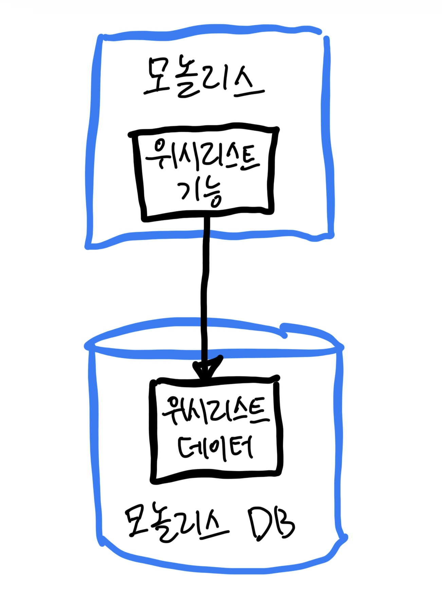
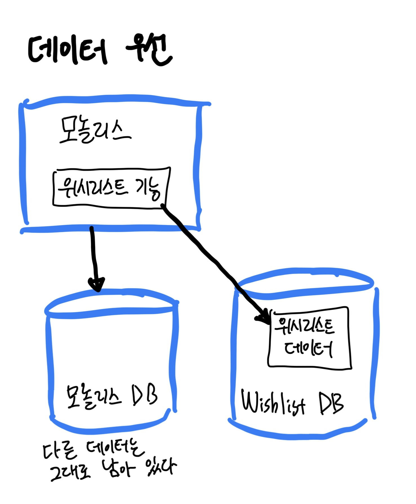

# Chapter03 모놀리스 분해

## 1. 목표를 가져라

- 마이크로서비스는 쉽지 않다. 처음에는 단순한 것을 시도하라.
- 달성하고자 하는 것을 포괄적으로 이해하지 못한다면, 맹목적으로 행동하고 있는 것이다.
- 따라서 달성하려는 변화가 무엇인지 명확히 하고 마이크로서비스를 고려하기 전에 최종 목표를 달성할 더 쉬운 방법을 고려하라.
    - 마이크로서비스가 가장 좋은 방법이라면, 그 최종 목표에 대한 진행 상황을 추적하고, 필요에 따라 진행 방향을 변경하라.

 

## 2. 점진적 마이그레이션

> 빅뱅식으로 재작성하면 보장되는 것은 빅뱅뿐이다.
> - 마틴 파울러

- 기존 모놀리식 시스템을 분해하는 것이 옳은 일이라고 판단하는 시점에 도달했다면 모놀리식을 한 번에 조금씩 떼어내는 것이 좋다.
    - 모놀리스를 대리석 블록으로 생각하라. 한 번에 전체를 깨버릴 수 있지만, 그 방법이 좋게 끝나는 경우는 드물다. 점진적으로 깎아내는 것이 훨씬 더 합리적이다.
- 마이크로서비스를 한 번에 하나씩 분리하면 빅뱅 배포를 기다리지 않고도 마이크로서비스가 제공하는 가치를 점진적으로 얻을 수 있다.
    - 작은 곳에서 시작하다.
    - 1~2개의 기능 영역을 선택하고 마이크로서비스로 구현해 운영 환경에 배포한 다음, 새 마이크로서비스를 만드는 것이 최종 목표에 더 가까워지는 데 도움이 됐는지 생각해보라.

 

## 3. 모놀리스가 적인 경우는 드물다

- 모놀리식 아키텍처는 본질적으로 **나쁘지** 않기 때문에 적으로 간주하면 안 된다는 점을 강조할 필요가 있다.
    - '모놀리스가 없는 것'에 집중하지 말고 대신 아키텍처 변경이 가져올 혜택에 집중하라.
- 기존의 모놀리식 아키텍처는 마이크로서비스로 전환한 후에도 종종 용량이 줄어들긴 하지만, 일반적으로 그대로 유지된다.
- 많은 사람이 모놀리스와 마이크로서비스가 공존하는 현실이 '엉망이라고 messy' 생각하지만, 현실 세계에서 운영 중인 시스템의 아키텍처가 결코 깨끗하거나 깔끔한 것은 아니다.
    - '클린' 아키텍처를 원한다면 완벽한 선견지명과 무한한 자금만 있으면 가질 수 있는 이상적인 시스템 아키텍처 버전을 하나 출력해서 박제해둬라.
    - 하지만 시스템 아키텍처는 끊임없이 진화하는 것으로, 요구와 지식의 변화에 따라 적응해야 한다.
- 놀랄 만큼 드문 상황에서도 모놀리스의 소멸은 어려운 요구 사항이 될 수 있다.
    - 기존의 모놀리스가 죽거나 죽어가는 기술에 기반을 두고 있거나, 폐기해야 하는 인프라스트럭처에 매여 있거나, 내다 버리고 싶은 값비싼 제삼자의 시스템인 상황으로 한정되는 경우가 많다.
    - 점진적 분해 접근법이 필요하다.

### 3-1. 조급한 분해의 위험성

- 도메인에 대한 이해가 명확하지 않을 때는 마이크로서비스를 생성하는 데 위험이 따른다.
- 시스템을 조기에 마이크로서비스로 분해하면 많은 비용이 들게 된다.
    - 특히 해당 도메인을 처음 접하는 경우에는 더욱 그렇다.
    - 여러 측면에서 마이크로서비스로 분해하려는 기존 코드베이스를 보유하는 것이 처음부터 마이크로서비스로 진행하는 것보다 훨씬 쉽다.

 

## 4. 무엇을 먼저 나눌까?

- 마이크로서비스가 좋은 아이디어라고 생각하는 이유를 확실히 파악해야 이 이해를 바탕으로 어떤 마이크로서비스를 먼저 만들어야 할지 우선순위를 정할 수 있다.
    - 애플리케이션 확장 => 현재 시스템의 부하처리 능력을 제한하는 기능이 가장 높은 순위
    - 출시 시간을 단축 => 시스템의 변동성을 살펴보고 가장 자주 변경되는 기능을 찾아내 마이크로서비스로 작동하는지 확인
- 하지만 어떤 분해가 실행 가능한지 고려해야 한다.
    - 일부 기능은 기존 모놀리식 애플리케이션에 너무 깊이 얽혀 있어 풀어낼 방법을 확인할 수 없다.
    - 어쩌면 문제의 기능이 애플리케이션에 매우 중요하므로 변경하면 매우 위험할지도 모른다. 또는 이전하려는 기능이 이미 자립형으로 되어 있어 추출이 매우 간단해 보일 수 있다.
- 기본적으로 어떤 기능을 마이크로서비스로 분할할지 결정하는 것을 결구 두 가지 힘 사이의 균형에 따라 결정될 것이다.
    1. **추출하는 작업의 용이성**
    2. **추출의 이점**

- 좀 더 '쉬운' 쪽에 가까운 것을 선택하라고 조언.
    - 전체 목표를 달성하는 데 어느 정도 영향을 미칠 수 있는 것으로 선택하되, 낮은 곳에 달린 과일처럼 쉽게 성취할 수 있는 것으로 고르는 것이다.
    - 이와 같은 전환, 특히 몇 달 또는 몇 년이 걸릴 전환에서는 초기에 추진력을 얻는 것이 중요하다. 빠른 성공 경험
- 가장 쉬운 마이크로서비스라고 생각되는 것을 추출하려고 시도했지만 성공하지 못했다면, 마이크로서비스가 우리 조직에 정말로 적합한지 다시 생각해봐야 한다.

 

## 5. 계층별 분해

- 추출할 첫 번째 마이크로서비스를 식별했다면, 더 작은 단계로 세분화할 수 있다.
- 웹 기반의 서비스 스택에 대한 기존 3계층을 고려하면 사용자 인터페이스, 백엔드 애플리케이션 코드, 데이터 측면에서 추출하려는 기능을 볼 수 있다.
- 마이크로서비스에서 사용자 인터페이스로의 매핑은 1:1이 아닌 경우가 많다.
    - 따라서 마이크로서비스와 관련된 사용자 인터페이스 기능을 추출하는 것은 별도의 단계로 간주될 수 있다.
    - 너무 많은 조직이 백엔드 기능의 분해를 통해 얻는 혜택에만 집중해 아키텍처를 재구성하는 데 지나치게 고립된 방식을 취하는 경우가 많다.
    - 때로는 UI 분해에서 가장 큰 혜택을 얻을 수 있으므로 이를 무사히는 것은 위험하다.
    - 마이크로서비스가 제공되기 전까지는 UI 분해의 가능성을 확인하기 어려우므로 UI 분해가 백엔드를 마이크로서비스로 분해하는 것보다 뒤처지는 경향이 있다.
- 아래 그림은 애플리케이션 코드와 데이터베이스에 관련된 일부 데이터 저장소를 보여준다.
    - 어떤 부분을 먼저 추출해야 할까?

### 5-1. 코드 우선

- 이 작업이 가장 일반적인 첫 번째 단계인 경우가 많다. 보다 단기적인 이익을 전달하기 쉽다는 이유가 주된 이유다.
- 모놀리식 데이터베이스에 데이터를 남겨두면 미래에 겪을 고통을 많이 축적하는 셈이 되므로 이 문제 역시 해결해야 한다.
    - 하지만 새로운 마이크로 서비스를 통해 많은 이점을 얻게 된다.
- 데이터베이스의 내용을 추출하는 것보다 더 쉬운 경향이 있다.
    - 애플리케이션 코드를 깔금하게 추출하기란 불가능하다는 사실을 알게 되면, 데이터베이스를 분해할 필요 없이 추가 작업을 중단할 수 있다.
    - 하지만 코드를 완전히 추출했을 때, 데이터 추출이 불가능하다고 판명되면 문제가 발생할 수 있다.
    - 따라서 데이터를 추출하기 전에 애플리케이션 코드를 추출하기로 결정했더라도 관련 데이터 저장소를 살펴보고 데이터 추출이 가능한지, 어떻게 진행할 것인지 등을 판단할 아이디어를 가지고 있어야 한다.
- 시작하기 전에 애플리케이션 프로그램 코드와 데이터가 모두 추출되는 방법을 스케치하는 작업을 수행하라.

### 5-2. 데이터 우선

- 단기적으로 이 방식의 주요 이점은 마이크로서비스의 전체 추출 위험을 피하는 것이다.
- 데이터베이스에 강제적인 데이터 무결성 손실이나 두 테이터 집합 간의 트랜잭션 작업 부족과 같은 문제는 사전에 처리해야 한다.

 

## 6. 유용한 분해 패턴

### 6-1. 교살자 무화과 패턴

- 마틴 파울러가 만든 개념이다. (`strangler fig pattern`)
- 이 패턴은 시간이 지남에 따라 기존 시스템을 새 시스템으로 감싸는 과정을 말하며, 새 시스템 이전 시스템의 기능이 점진적으로 더 많이 차지하게 된다.
- 기존 시스템에 대한 호출을 가로챈다.
- 새로운 마이크로서비스 아키텍처에서 해당 기능에 대한 호출이 구현되면 마이크로서비스로 리다이렉션된다.
- 기능이 여전히 모놀리스에서 제공되는 경우 모놀리스에 대한 호출을 계속할 수 있다.
- 이 패턴의 장점은 모놀리식 애플리케이션을 변경하지 않고 수행할 수 있다는 것이다. 모놀리스는 심지어 새로운 시스템에 의해 '감싸진 wrapped' 것도 모른다.

### 6-2. 병렬 실행

-기존 시스템 동작을 위험에 빠뜨리지 않고 새로운 기능이 잘 동작하는지 확인하는 한 가지 방법은 `병렬 실행 parallel run` 패턴을 사용하는 것이다.
- 즉, 모놀리식 기능 구현과 새로운 마이크로서비스 구현을 나란히 실행해 같은 요청을 제공하고 결과를 비교한다.

### 6-3. 기능 토글

- `기능 토글`은 제품 기능을 켜거나 끄고 아니면 기능에 대한 2개의 다른 구현 사이를 오가게 하는 매커니즘이다.
    - 기능 토글은 일반적으로도 적용 가능성이 좋은 패턴이지만 마이크로서비스 마이그레이션에서 특히 유용하다.
- 전환하는 동안 기존 기능을 모놀리스에 그대로 두는 경우가 많으며, 기능 버전 간에 전환하는 수단이 필요하다.

 

## 7. 데이터 분해에 대한 우려

### 7-1. 성능

- 관계형 데이터베이스는 서로 다른 테이블 간에 데이터를 조인하는 기능이 좋다. 매우 좋다.
- 그러나 종종 마이크로서비스라는 이름으로 데이터를 분리하면 결국 데이터 계층에서 마이크로서비스 자체로 조인 작업을 이동해야 한다.
    - 그리고 아무리 노력해봐도 속도가 빨라지기는 어렵다.
- 논리적으로 조인 작업을 진행할 수 있지만, 이제는 데이터베이스가 아닌 마이크로서비스 내부에서 일어나게 된다.
    - 조인 작업이 데이터베이스 계층에서 애플리케이션 코드 계층으로 이동한 것이다.
    - 불행히도 이 작업은 조인보다 효율적이지 않다.
    - 이 상황에서 전반적인 지연 시간이 증가하지 않았다면 매우 놀랄지도 모른다.
    - 빈번한 작업이라면 문제가 될 수 있다. => 로컬에 캐싱해 지연 시간 증가가 미치는 영향을 완화할 수 있다.

### 7-2. 데이터 무결성

- 데이터베이스는 데이터무결성을 보장하는 데 유용하다.
    - 예를 들어, 외래키를 통해 데이터가 존재하는 것을 항상 보장할 수 있다.
- 테이블이 서로 다른 데이터베이스에 있으면 더 이상 데이터 모델의 무결성을 강제할 수 없다.
    - 테이블에서 행을 삭제하는 것을 막을 방법이 없으므로 정확히 어떤 항목에서 변경됐는지 알아내려고 하면 문제가 발생한다.
- 무결성을 적용하기 위해 더 이상 데이터베이스에 의존할 수 없다는 사실에 익숙해져야 한다. 물론, 한 데이터베이스 내부에 남아 있는 데이터의 경우 문제가 되지 않는다.
- `대체 패턴 coping pattern`이 이 문제를 해결할 방법을 잘 표현하는 용어인 것 같다.
    - soft delete
    - 테이블에 데이터 복사해오기

### 7-3. 트랜잭션

- 여러 데이터베이스에 걸쳐 데이터를 분할하기 시작하면 익숙한 ACID 트랜잭션의 안정성을 잃게 된다.
- 모든 상태 변화가 단일 트랜잭션의 경계 안에서 관리되는 시스템에 익숙한 사람들에게 분산 시스템으로 전환하는 것은 다소 충격적일 수 있다.
    - 그리고 이 충격에 대한 대응으로 더 간단한 아키텍처로 ACID 트랜잭션이 제공했던 안정성을 되찾고자 분산 트랜잭션을 구현하는 경우가 많다.
    - 분산 트랜잭션은 잘 수행되더라도 구현하기 복잡할 뿐 아니라 보다 좁은 범위에 적용된 데이터베이스 트랜잭션에 기대했던 것과 같은 보장도 제공하지 않는다.

### 7-4. 도구

- 데이터베이스 변경은 여러 가지 이유로 어려운 작업인데, 쉽게 변경할 수 있는 도구가 제한돼 있다는 점이다.
- 관계형 데이터베이스의 스키마 변경 프로세스를 관리하는 많은 도구가 있지만, 대부분은 동일한 패턴을 따른다.
    - 각 스키마의 변경 사항은 버전 제어되는 델타 스크립트에서 정의된다.
    - 이러한 스크립트는 `멱등적 idempotent` 방식으로 엄격한 순서에 의해 실행된다.
    - `플라이웨이 Flyway`나 `리퀘베이스 Liquibase` 추천

### 7-5. 리포팅 데이터베이스

- 모놀리식 애플리케이션에서 마이크로서비스를 추출하는 과정에서 내부 데이터 저장소에 대한 액세스를 숨기려고 데이터베이스를 분리하기도 한다.
    - 데이터베이스에 대한 직접 액세스를 숨기면 안정적인 인터페이스를 더 잘 구축할 수 있어 독립적인 배포가 가능해진다.
    - 둘 이상의 마이크로서비스에서 데이터에 액세스하는 정당한 사용 예가 있거나, 해당 데이터가 REST API 같은 것을 통하지 않고 데이터베이스를 통해 더 잘 제공되는 경우 문제가 발생한다.
- 대신 리포팅 데이터베이스를 사용할 경우, 외부 액세스용으로 설계된 전용 데이터베이스를 만들고, 마이크로서비스가 내부 저장소의 데이터를 외부에서 액세스 가능한 리포팅 데이터베이스로 푸시하는 작업을 담당한다.
    - 내부 상태 관리를 숨기면서도 여전히 데이터베이스에서 데이터를 제공할 수 있다.
- 여기서 강조해야할 두 가지 핵심 사항이 있다.
1. 우리는 여전히 정보 은닉을 실천하길 원한다.
    - 따라서 리포팅 데이터베이스에 최소한의 데이터만 노출해야 한다. 리포팅 데이터베이스에 있는 데이터는 단지 마이크로서비스가 저장하는 데이터의 일부일 수 있다.
    - 하지만 직접적인 매핑은 아니므로 리포팅 데이터베이스의 스키마를 사용자 요구 사항에 정확히 맞출 기회를 제공한다.
    - 예를 들면 근본적으로 다른 스키마를 사용하거나 다른 종류의 데이터베이스 기술을 함께 사용할 수도 있다.
2. 리포팅 데이터베이스를 다른 마이크로서비스 엔드포인트와 동일하게 취급해야 한다.
    - 마이크로서비스가 내부 구현의 세부 정보를 변경하더라도 이 엔드포인트의 호환성이 유지되도록 하는 것이 마이크로서비스 `유지 보수자 maintainer`의 역할이다.
    - 내부 상태에서 리포팅 데이터베이스로의 매핑은 마이크로서비스를 직접 개발하는 사람들의 책임이다.

 

# 참고 자료

- 마이크로서비스 아키텍처 구축, 샘 뉴먼 지음

